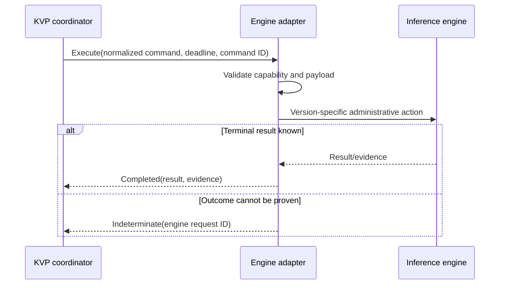

# Adapter contract

Status: specified

## Purpose

An adapter is an isolated compatibility component that translates normalized KVP
operations into an engine's supported administrative interface. It must not claim
support based on desired behavior; capabilities are backed by implementation and
conformance tests for a concrete engine version range.

## Responsibilities

An adapter:

- authenticates to the KVP control plane with its own workload identity;
- registers engine name, engine version, adapter version, instance identifier,
  and supported capability descriptors;
- validates operation payloads again at its boundary;
- translates normalized commands without broadening their authority;
- attaches a stable engine request identifier where supported;
- reports result, evidence, and observation time;
- never logs session tokens, prompts, raw cache blocks, private keys, or secrets.

An adapter does not issue operator sessions, decide global RBAC policy, or expose
an engine API directly to KVP clients.

## Capability model

A capability descriptor contains:

- operation and schema version;
- support level: `NATIVE`, `EMULATED`, or `OBSERVE_ONLY`;
- engine and adapter version constraints;
- payload limits and expected execution class;
- idempotency guarantee: `ENGINE`, `ADAPTER`, or `NONE`;
- evidence type returned after execution;
- required engine permission or feature flag.

KVP rejects a command before dispatch when the selected adapter does not declare
a compatible capability. `EMULATED` behavior must be visible to clients because
it may have different atomicity or performance from a native engine operation.

## Initial operation mapping

| KVP operation | Required behavior | v0 mock | Initial vLLM expectation |
| --- | --- | --- | --- |
| `OPERATION_GET_STATUS` | Return versioned health and capability evidence | Native | Supported through documented status/metrics surfaces |
| `OPERATION_UPDATE_PARAMETERS` | Update an explicitly allowlisted control set | Native | Limited; request-scoped parameters are not global engine mutation |
| `OPERATION_TRIGGER_COMPACTION` | Request a documented cache compaction action | Emulated | Unsupported until a stable engine control exists |
| `OPERATION_SWITCH_MODEL` | Change active model with explicit drain semantics | Emulated | Usually process/orchestrator lifecycle, not an in-process API |
| `OPERATION_INVALIDATE_CACHE` | Invalidate only an identified cache scope | Native | Unsupported until scope and engine API are proven |

The exact vLLM mapping requires a version-pinned feasibility spike. Sending a
chat-completions request is not equivalent to controlling internal KV-cache state.

## Command lifecycle

Adapter execution is bounded by the propagated deadline, but cancellation does
not imply that the engine rolled back an operation. When an engine cannot provide
idempotency or status reconciliation, KVP marks that capability unsafe for
automatic retry.

## Conformance requirements

Each adapter release must pass:

1. identity and registration tests;
2. capability-schema compatibility tests;
3. allowlist and invalid-payload negative tests;
4. duplicate-command and timeout tests;
5. engine-version compatibility tests;
6. log redaction tests;
7. loss-of-connectivity and uncertain-outcome tests.
