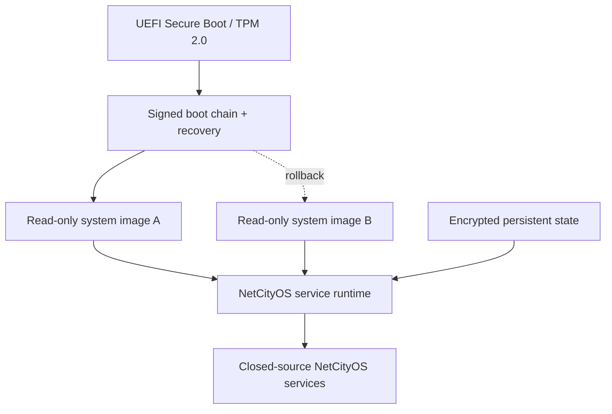

# NetCityOS appliance platform

Status: architecture baseline; distribution choice accepted for pilot

## Product form

NetCityOS is delivered as an installable Enterprise appliance for a clean
physical server, workstation, or dedicated virtual machine. The customer boots a
signed installer image, selects a supported hardware profile, initializes
organization trust, and receives the complete NetCityOS environment rather than
assembling a collection of packages manually.

## Base distribution decision

The pilot and first Enterprise release use a pinned minimal Debian 13 stable base
to obtain mature server hardware and driver compatibility while keeping the
product services separately versioned and proprietary. Debian reports a five-year
Debian 13 lifecycle through June 2030. The shipped product is branded NetCityOS,
with required upstream notices and no implication that Debian endorses it.

The production image is not a general-purpose Debian installation. It is built
from an allowlisted package manifest, hardened, image-updated, and closed to
unmanaged package installation. A Yocto-based custom distribution remains a
later option once the hardware/BSP matrix stabilizes; Yocto is designed for
tailored Linux systems and reproducible license manifests but has materially
higher build and maintenance complexity.

Sources current on 2026-07-20:

- [Debian 13 stable release and lifecycle](https://www.debian.org/releases/stable/)
- [Yocto Project overview](https://docs.yoctoproject.org/current/overview-manual/yp-intro.html)
- [Yocto custom distribution guidance](https://docs.yoctoproject.org/dev/dev-manual/custom-distribution.html)

## Image layout

The exact partition technology is selected during the installer prototype, but
the invariant is signed A/B system images with a separately encrypted state
partition and recovery path. Updating system files in place with an unrestricted
package manager is not the production model.

## Service composition

| Layer | Contents | Mutability |
| --- | --- | --- |
| Firmware/boot | Secure Boot keys, bootloader, TPM measurements, recovery | Signed release only |
| Base system | Linux kernel, systemd, network/storage, approved GPU/runtime drivers | Immutable image |
| Service runtime | OCI runtime, service supervision, local PKI bootstrap, health | Immutable image/config refs |
| Product services | Workspace, Architect OS, Runtime/Fleet/Governance, KVP | Signed proprietary images/packages |
| Customer state | database, policies, architecture graphs, evidence spool, secrets refs | Encrypted and backed up |
| Extensions | signed connectors/adapters from approved registry | Policy-governed |

Product services are isolated processes or OCI containers supervised by systemd.
The initial node does not embed Kubernetes; multi-node orchestration is added only
when the control-plane semantics and operational need justify its complexity.

## Installation flow

1. Verify signed installer and supported hardware profile.
2. Validate UEFI, TPM, CPU virtualization, storage, network, RAM, and optional GPU.
3. Partition disks and enable encryption; establish recovery material.
4. Install signed base and recovery images.
5. Create the organization root/bootstrap identity or enroll into enterprise PKI.
6. Initialize local state, audit, and administrator identity.
7. Select connected or air-gapped update channel.
8. Run acceptance tests and produce an installation evidence bundle.
9. Expose the Enterprise Workspace only after readiness gates pass.

## Deployment profiles

- **Single-node pilot** — all control services and optional local engine on one
  server; not a high-availability profile.
- **Enterprise node** — appliance control/runtime plus separate database and
  model/GPU nodes.
- **Cluster cell** — multiple control/runtime nodes with durable external state
  and cell-scoped connectors.
- **Air-gapped cell** — offline signed bundles, local trust, no cloud connectors.
- **Operator workstation** — reduced local appliance for design/testing; cannot
  silently become a production authority.

## Update and rollback

Updates are complete signed release bundles containing system image, product
artifacts, migrations, SBOM, license notices, compatibility metadata, and release
evidence. The inactive system slot is written and verified before reboot. Health
gates commit the new slot; boot or migration failure triggers a controlled
rollback or recovery workflow.

Database rollback is separate from system-image rollback. A binary rollback that
cannot read the migrated schema is blocked before deployment. Security revocation
bundles can be applied offline and outside the normal feature cadence.

## Hardware support boundary

The first target is UEFI x86-64 server hardware with TPM 2.0. ARM64 is a later
profile. GPU enablement is packaged as tested hardware profiles because NVIDIA,
AMD, firmware, kernel, and engine compatibility have separate licensing and
upgrade constraints. Unsupported drivers cannot be installed through the
production interface.

## Closed-source boundary

NetCityOS application code, proprietary KVP implementation, Architect OS,
Enterprise Workspace, policy packs, conformance suite, and commercial connectors
are distributed only as signed binaries/images under the NetCityOS commercial
license. Open-source components remain under their original licenses; the image
build keeps notices, source obligations, and component provenance separate from
the proprietary source repository.
