# Architect OS

Status: product and architecture concept

## Role inside NetCityOS

Architect OS is the architecture intelligence and composition subsystem. It
turns an operator's intent into a versioned, analyzable graph of model fleets,
agents, tools, data boundaries, policies, runtime routes, and evidence
requirements. It does not bypass KVP or directly mutate infrastructure.

## Architecture graph

Each graph version contains:

- typed nodes: model pool, agent, tool, data source, policy boundary, approval,
  evaluator, queue, gateway, evidence sink, human role;
- typed edges: request, context, control, tool invocation, evidence, dependency;
- constraints: region, provider, model class, data classification, latency, cost,
  availability, approval, and capability requirements;
- immutable artifact references and environment overlays;
- provenance: author, source intent, parent version, review, and release status.

## Compilation pipeline

```mermaid
flowchart LR
    Intent["Operator intent"] --> Draft["Typed architecture graph"]
    Draft --> Static["Schema & invariant validation"]
    Static --> Resolve["Fleet/capability resolution"]
    Resolve --> Policy["Policy, residency, budget, approvals"]
    Policy --> Sim["Simulation & impact analysis"]
    Sim --> Plan["Signed execution plan"]
    Plan --> KVP["KVP commands / Runtime deployment"]
    KVP --> Evidence["Observed state & evidence"]
    Evidence --> Drift["Drift and conformance analysis"]
```

## Key services

1. **Graph Registry** — immutable architecture versions and lineage.
2. **Constraint Engine** — validates structural and enterprise invariants.
3. **Capability Resolver** — binds abstract requirements to compatible fleets,
   connectors, tools, and regions.
4. **Plan Compiler** — produces deterministic, reviewable execution plans.
5. **Simulator** — estimates blast radius, cost, quotas, failure paths, and policy
   consequences without touching production.
6. **Drift Analyzer** — compares desired graph, deployed state, provider state,
   and KVP evidence.
7. **Architecture Copilot** — proposes graph changes but has no execution
   authority; every proposal passes the same validators as a human change.

## Safety properties

- A natural-language request cannot become a privileged command directly.
- Graph validation is deterministic and versioned.
- Plans bind the exact architecture, policy, catalog, and capability versions.
- Deployment is resumable and idempotent; partial results are visible.
- Rollback is a new reviewed plan, not an unlogged database rewind.
- Observed drift never silently rewrites desired architecture.

## Differentiation

Architect OS creates a persistent enterprise architecture model across providers
and local infrastructure. Its value is not merely drawing boxes: it compiles a
governed graph into execution, relates every runtime event back to that graph,
and supports evidence-based evolution of complex model/tool systems.
