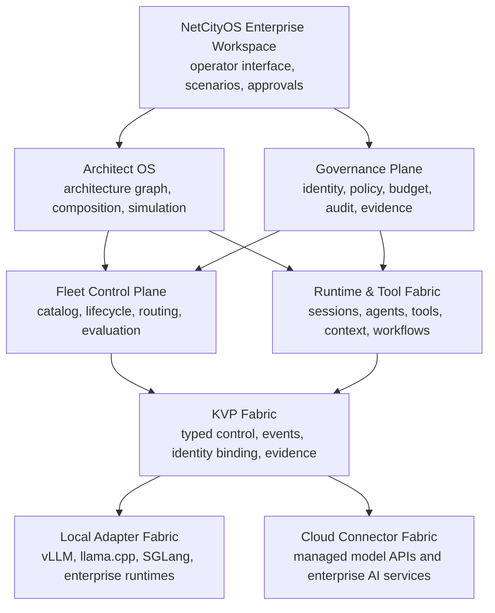
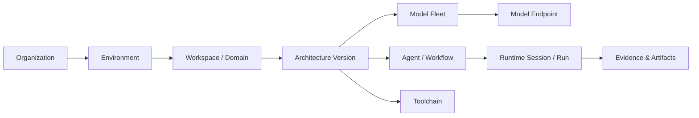
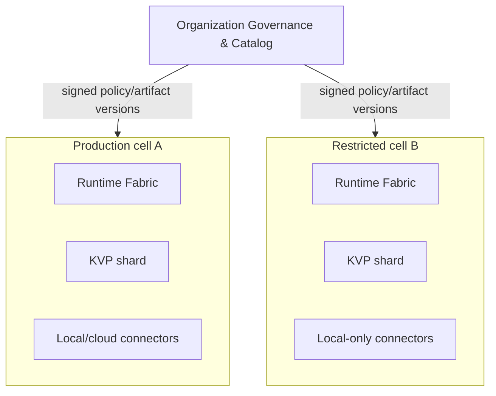

# NetCityOS platform architecture

Status: product architecture baseline

## Mission

NetCityOS is an Enterprise operating environment for designing, governing, and
operating systems built from models, agents, tools, data connections, and human
operators. KVP is its protected protocol and control fabric, not the whole
product. Architect OS provides the higher-order architecture layer, while the
Enterprise Workspace is the operator-facing environment.

The platform supports local engines and cloud model providers. It exposes one
governed object model without pretending that a third-party cloud API has the
same trust boundary or low-level controls as a locally managed engine.

## Product stack

The complete stack runs on the [NetCityOS appliance platform](appliance-platform.md),
a signed, hardened Linux-based environment installed on clean hardware or a
dedicated virtual machine.

## Four planes

| Plane | Carries | Does not carry by default |
| --- | --- | --- |
| Control | identities, policies, deployments, model/tool configuration, lifecycle commands | prompt bodies and generated tokens |
| Runtime data | model requests, context references, tool inputs/outputs, workflow state | private keys and control-plane bearer tokens |
| Evidence | audit events, evaluations, attestations, approvals, lineage | unrestricted raw customer content |
| Experience | operator views, architecture graphs, scenarios, incident actions | direct ungoverned provider credentials |

KVP defines protected control and evidence semantics. NetCityOS Runtime Fabric
owns governed model and tool execution. This preserves the KVP control/data-plane
separation while allowing the complete platform to work with inference content.

## Core bounded contexts

| Context | Primary objects | Responsibility |
| --- | --- | --- |
| Organization | organization, environment, principal, team | isolation and ownership |
| Architecture | architecture, component, edge, constraint, version | desired multi-layer system graph |
| Fleet | model endpoint, deployment, pool, route, capability | available execution capacity |
| Runtime | session, agent, workflow, tool call, context reference | governed execution |
| Governance | policy, approval, budget, risk class, evidence | authorization and accountability |
| KVP | session token, command, adapter, capability, outcome | protected delivery and reconciliation |
| Artifact | prompt template, policy pack, connector, evaluation, release | versioned reusable assets |

Bounded contexts exchange identifiers and immutable versions. They do not share
mutable database tables or bypass each other's authorization boundary.

## Managed hierarchy

This hierarchy is a policy scope, not merely a navigation tree. Permissions,
budgets, data residency, provider allowlists, and audit retention can inherit
downward with explicit, reviewable overrides.

## Local and cloud execution

Local adapters can expose deep lifecycle, engine, and cache capabilities when
the engine genuinely supports them. Cloud connectors expose provider-supported
models, tools, quotas, regions, and request controls. A connector never claims
GPU/cache attestation or engine mutation when the provider does not offer
verifiable evidence.

Provider credentials are stored in an enterprise secret system and resolved by
workload identity. Operators select governed connection profiles, never view or
paste raw production API keys into architecture graphs or scenarios.

## Enterprise deployment cells

A deployment is divided into cells by environment or regulatory boundary. Each
cell contains Runtime Fabric, a KVP control-plane shard, local/cloud connectors,
and an evidence spool. Organization-level catalog and governance services manage
approved versions but cannot silently cross a cell's data-residency policy.

## Non-negotiable boundaries

- The interface cannot directly call an engine or cloud provider outside the
  Runtime/KVP path.
- An architecture diagram is not executable until policy validation, capability
  resolution, budget checks, and approval obligations succeed.
- Cloud-provider success responses are provider evidence, not KVP attestation of
  internal model state.
- Prompt, context, and tool data are classified before routing across cells or
  providers.
- Every state-changing operator action has a principal, target, architecture
  version, policy decision, command identity, and outcome trail.

## Relationship to KVP

The detailed protected transport and command architecture remains in
[KVP system architecture](kvp-architecture.md). NetCityOS depends on KVP for
trusted coordination but retains useful product boundaries: the workspace,
architecture graph, fleet catalog, policy system, and runtime can evolve without
embedding provider-specific protocol details into the interface.
