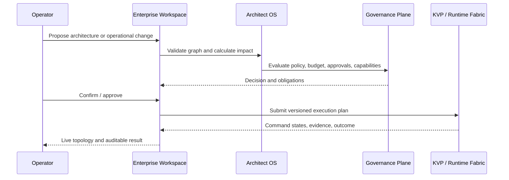

# NetCityOS Enterprise Workspace

Status: product concept baseline

## Purpose

The Enterprise Workspace is not a conventional chat shell. It is an operational
environment where authorized users design architectures, control model fleets,
run governed scenarios, supervise agents and tools, inspect evidence, and respond
to incidents from one consistent object model.

## Primary work surfaces

| Surface | User outcome |
| --- | --- |
| Architecture Canvas | Compose models, agents, tools, data boundaries, policies, and routes as a versioned graph |
| Fleet Operations | Observe and control local/cloud endpoints, pools, quotas, deployments, and health |
| Scenario Studio | Define repeatable human/model/tool workflows with approvals and test cases |
| Runtime Console | Supervise sessions, interventions, tool calls, costs, and execution evidence |
| Governance Center | Manage policies, roles, provider allowlists, budgets, risk classes, and exceptions |
| Evaluation Lab | Compare models/routes and promote only evidence-backed versions |
| Incident Desk | Revoke identities, quarantine adapters, freeze routes, reconcile uncertain commands |
| Artifact Registry | Version prompts, policies, connectors, evaluations, architecture releases, and runbooks |

## Interaction model

Every visible action operates on a typed object and produces a proposed state
transition. The interface shows scope, blast radius, cost/risk estimate, policy
decision, required approvals, and expected adapter capabilities before execution.
The resulting KVP command identity and evidence remain attached to the visual
object rather than disappearing into a chat transcript.

## Multi-layer navigation

The same system can be viewed at organization, environment, architecture, fleet,
endpoint, agent, workflow, session, command, or evidence level. Zooming changes
detail, not identity: every lower-level object remains traceable to its parent
architecture version and governance context.

## Enterprise requirements

- SSO federation and step-up authentication for high-risk actions;
- fine-grained authorization and separation of duties;
- multi-environment and cell-aware data residency;
- approval workflows and emergency break-glass with enhanced audit;
- accessibility, localization, and large-topology performance;
- immutable history, comparison, rollback proposal, and export;
- provider cost, quota, rate-limit, and contractual-boundary visibility;
- no production secrets, unrestricted prompts, or private keys in browser state.

## Not a chat transcript

Conversation can be one interaction modality, but it cannot be the system of
record. Decisions become typed architecture changes, scenario steps, commands,
approvals, artifacts, and evidence. Free-form model output never gains control
authority without parsing, validation, policy, and explicit execution semantics.
