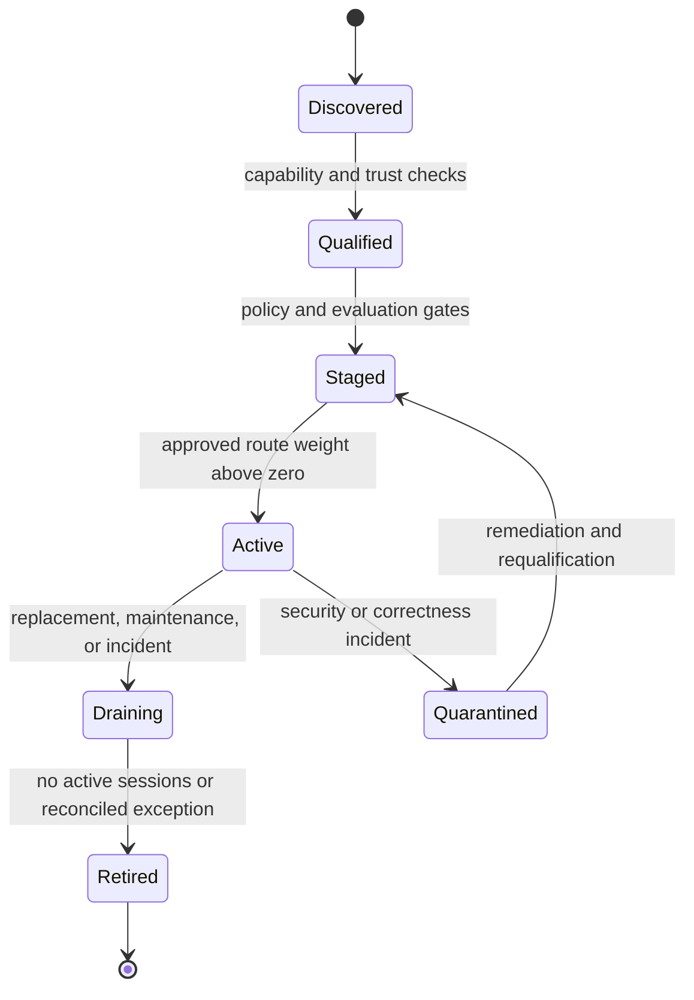

# Model fleet management

Status: architecture baseline

## Fleet object

A fleet is a governed pool of compatible local or cloud endpoints serving one or
more architecture requirements. Compatibility includes semantic model family,
capability contract, data classification, region, evidence level, and approved
connector version—not only a model display name.

## Lifecycle

## Control functions

- inventory and capability snapshots;
- health, quota, cost, latency, and evaluation telemetry;
- weighted and policy-constrained routing;
- staged releases, canaries, drains, rollback plans, and quarantine;
- local capacity placement and cloud quota allocation;
- model/provider deprecation and architecture impact analysis;
- configuration drift and evidence-level monitoring.

## Scale model

Fleet views aggregate thousands of endpoints but keep command scope explicit.
Bulk operations compile into a plan of individually identifiable KVP commands.
The UI shows target selection, exclusions, concurrency, failure threshold,
approval, and stop conditions before execution.

## Failure semantics

A bulk plan can be partially successful. NetCityOS records per-target terminal or
indeterminate state, halts according to policy, and produces a reconciliation
plan. It never reports fleet success solely from an aggregate percentage while a
high-risk target remains unknown.

## Cloud-specific controls

Cloud fleet management covers approved model versions, regions, accounts,
projects, rate limits, budgets, contractual data-use settings, and connector
health. It does not claim provider-internal deployment control unless exposed by
the provider's documented management API.
