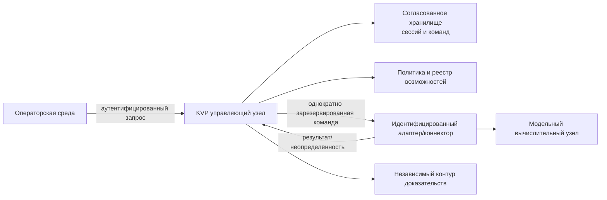

# Техническое раскрытие предполагаемого изобретения KVP

Гриф: КОНФИДЕНЦИАЛЬНО — ДО ПОДАЧИ НЕ РАСКРЫВАТЬ

Статус: инженерная основа для патентного поверенного, не формула заявки.

## 1. Идентификационные сведения

| Поле | Значение |
| --- | --- |
| Рабочее название | Способ и система защищённого управления гетерогенными узлами выполнения моделей с согласованием возможностей и идемпотентным подтверждением состояния |
| Краткое название | KVP control and evidence fabric |
| Дата документа | 20.07.2026 |
| Заявитель/будущий правообладатель | ООО «НетСити» — подтвердить точное наименование, ОГРН/ИНН |
| Изобретатели | Указать физических лиц и фактический творческий вклад |
| Источник прав | Служебное изобретение/договор отчуждения — подтвердить по каждому лицу |
| Внешние раскрытия | Заполнить журнал дат, адресатов, NDA, презентаций и демонстраций |

## 2. Область техники

Решение относится к управлению распределёнными вычислительными системами,
исполняющими модели машинного обучения, и к защищённой доставке, авторизации,
согласованию и подтверждению управляющих воздействий между операторской средой,
управляющим узлом и гетерогенными локальными или облачными исполнительными
узлами.

## 3. Техническая проблема

Различные модельные движки и облачные сервисы предоставляют несовместимые
интерфейсы и неодинаковые гарантии. При сетевом сбое ответ может быть потерян,
повтор команды — вызвать вторичное воздействие, а общий статус — не отражать
фактическую возможность конкретного узла. Обычная транспортная аутентификация не
связывает воедино идентичность, разрешение, порядок, способность адаптера,
единственность команды и последующее доказательство результата.

## 4. Сущность предлагаемого решения

Управляющий узел:

1. получает подтверждённую транспортную идентичность инициатора;
2. сопоставляет её с зарегистрированным субъектом и связывает с короткоживущей
   сессией;
3. принимает типизированную команду, уникальный идентификатор и номер
   последовательности;
4. проверяет срок, политику, область воздействия и объявленную возможность
   целевого адаптера;
5. вычисляет канонический отпечаток команды;
6. атомарно резервирует идентификатор команды, продвигает последовательность и
   создаёт преддиспетчерское событие доказательства;
7. передаёт команду идентифицированному адаптеру вне транзакции хранения;
8. сохраняет завершённый, отклонённый либо неопределённый результат;
9. при повторе возвращает сохранённое состояние без повторного воздействия, а
   при конфликтующем отпечатке отклоняет запрос;
10. допускает последующее согласование неопределённого результата по
    авторитетному идентификатору/доказательству адаптера или движка.

## 5. Кандидатные существенные признаки

- связывание сессии и каждой операции с подтверждённой идентичностью канала;
- типизированное управляющее воздействие с явной областью и целевым адаптером;
- совместная проверка роли/политики и версионированной возможности адаптера;
- комбинация возрастающей последовательности с долговременным идентификатором
  команды, действующим при переподключении/смене сессии;
- атомарное резервирование отпечатка команды и преддиспетчерского доказательства;
- запрет повторной диспетчеризации при совпадающем идентификаторе и отпечатке;
- явное состояние неопределённого результата и отдельная процедура согласования;
- привязка результата к версии политики, возможности, архитектуры и целевого узла;
- раздельные управляющий, исполнительный и доказательный контуры.

Признаки должны быть переработаны после поиска: многие по отдельности известны,
и потенциальная новизна может находиться только в конкретной технической
комбинации и механизме взаимодействия.

## 6. Предполагаемый технический результат

Результат формулируется и измеряется на стенде:

- отсутствие повторного воздействия при N повторных передачах одной команды;
- обнаружение конфликтующей команды до её передачи адаптеру;
- сохранение восстанавливаемого статуса после отказа управляющего узла;
- уменьшение несогласованных состояний парка при частичном сетевом отказе;
- ограничение передачи чувствительного содержимого управляющим контуром;
- отклонение операций, не подтверждённых возможностями выбранного узла.

Нельзя использовать абстрактные результаты вроде «повышение удобства»,
«монополизация» или «улучшение бизнеса» как замену техническому результату.

## 7. Варианты осуществления

### Вариант A — локальный модельный движок

Адаптер находится в доверенной зоне заказчика, имеет отдельную рабочую
идентичность и ограниченный доступ к административному API движка. Он может
возвращать расширенное доказательство состояния только для реально доступных и
проверяемых объектов.

### Вариант B — облачная модель

KVP управляет локальным облачным коннектором. Коннектор получает разрешённый
профиль провайдера и рабочую учётную запись, преобразует запрос в провайдерский
API и возвращает провайдерские метаданные. KVP не утверждает контроль внутреннего
KV-кэша или инфраструктуры облачного провайдера.

### Вариант C — пакетная команда парку

План верхнего уровня детерминированно разворачивается в набор индивидуально
идентифицируемых команд. Для каждой цели сохраняется отдельный результат;
пороговые условия останавливают дальнейшую диспетчеризацию без потери уже
полученных состояний.

## 8. Черновой каркас пунктов формулы

Не использовать для подачи без поверенного.

### Независимый пункт «способ»

Способ управления множеством гетерогенных вычислительных узлов, включающий
получение типизированной команды от аутентифицированного субъекта, сопоставление
с версионированной возможностью целевого адаптера, формирование канонического
отпечатка, атомарное резервирование идентификатора и состояния команды до
передачи, передачу адаптеру, сохранение результата и обработку повторного запроса
без повторного исполнения при совпадении идентификатора и отпечатка.

### Независимый пункт «система»

Система, содержащая интерфейс аутентифицированного приёма, модуль идентичности и
политики, согласованное хранилище сессий/команд, реестр возможностей, координатор
диспетчеризации, по меньшей мере один адаптер и модуль доказательств, настроенные
на выполнение указанного способа.

Зависимые пункты могут раскрывать последовательность, неопределённый результат,
согласование, пакетный план, подпись доказательства, локальный/облачный вариант и
привязку версии архитектуры. Набор определяет поверенный после анализа единства.

## 9. Эксперименты и доказательства

- стенд с искусственной потерей ответа до/после исполнения;
- параллельная отправка одинакового и конфликтующего `command_id`;
- смена сессии при сохранении идентичности субъекта;
- отзыв сертификата/субъекта во время выполнения;
- изменение capability epoch до и после резервирования;
- падение базы, адаптера и audit sink в каждой точке метода;
- сравнение с обычным gRPC/REST без устойчивого координатора;
- измерение задержки, числа дубликатов и несогласованных состояний.

## 10. Комплект для патентного поверенного

Официальная страница Роспатента перечисляет заявление, достаточное описание,
формулу, чертежи/иные материалы при необходимости и реферат. Передача поверенному
включает этот документ, диаграммы, прототип, тестовые результаты, журнал
раскрытий, сведения об изобретателях/заявителе и отчёт поиска уровня техники.

Источник: [государственная регистрация изобретения — Роспатент](https://rospatent.gov.ru/ru/stateservices/gosudarstvennaya-registraciya-izobreteniya-i-vydacha-patenta-na-izobretenie-ego-dublikata).
