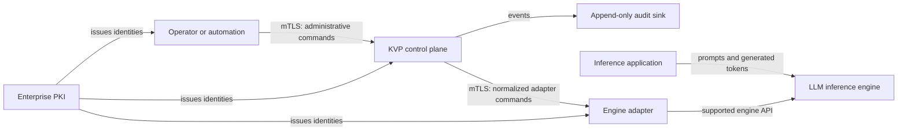
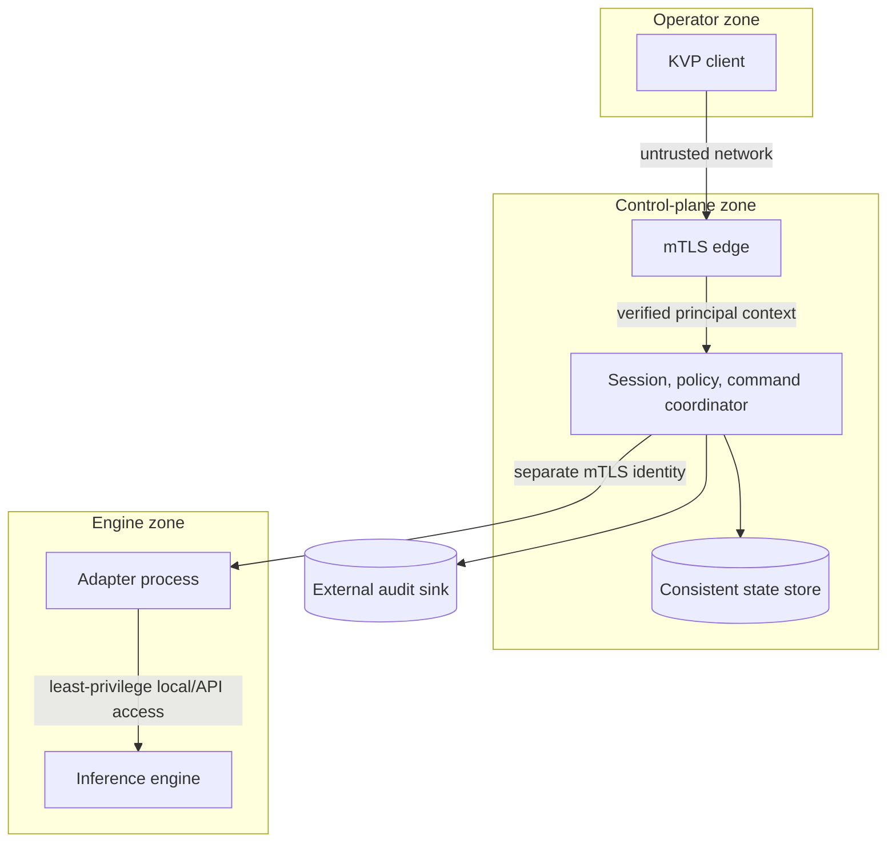

# KVP system architecture

Status: specified for KVP v0

## Architectural intent

KVP is an authenticated, policy-enforced control plane in front of heterogeneous
LLM engine adapters. It normalizes administrative commands and evidence, not
inference traffic. The architecture assumes that every network and process
boundary can be hostile until identity and authorization are verified.

## Context

Prompt and token traffic does not traverse KVP v0. This prevents the control
plane from becoming a high-volume inference proxy and reduces the quantity of
sensitive model data it can observe.

## Logical components

| Component | Responsibility | Security boundary |
| --- | --- | --- |
| Edge transport | TLS termination, peer certificate validation, request limits | Rejects unauthenticated peers before protobuf handling |
| Identity mapper | Maps certificate identity to one active principal | Never trusts `client_id` without certificate binding |
| Session service | Creates, expires, and revokes opaque sessions | Session token is a bearer secret bound to the principal |
| Policy engine | Deny-by-default authorization for every operation | Policy decision precedes adapter dispatch |
| Command coordinator | Validation, idempotency, ordering, deadlines, dispatch | Atomically reserves accepted commands |
| Adapter registry | Tracks adapter identity, health, and capabilities | An adapter can receive only commands it declares |
| Audit writer | Records decisions and outcomes without payload secrets | Failure policy is operation-dependent and explicit |
| Engine adapter | Translates normalized operations to a supported engine API | Runs separately from the KVP control plane |

The session and authorization state machine currently exists in `kvp-core`.
Transport identity binding, idempotency, adapter dispatch, and durable audit are
specified but not yet implemented.

## Deployment model

KVP v0 targets one enterprise trust domain per deployment. A minimal production
deployment contains:

1. two or more stateless KVP control-plane replicas behind an mTLS-aware load
   balancer;
2. one strongly consistent state store for sessions, command reservations,
   revocation, and adapter registrations;
3. one durable audit sink outside the KVP process;
4. one separately deployed adapter per engine administrative boundary;
5. enterprise PKI, certificate rotation, and revocation distribution.

The first development milestone may use one KVP process, an in-memory store, a
mock adapter, and a local audit file. Development shortcuts must be impossible to
enable accidentally in a production build or configuration.

## Trust boundaries

No certificate private key is stored in the state database. No user-provided
identifier can override the principal derived from the authenticated transport.

## Availability and consistency

- Session revocation and command reservation require consistent reads.
- Status telemetry may be eventually consistent and carry an observation time.
- A command is never reported `COMMAND_STATE_COMPLETED` before the adapter result is durably
  associated with its command reservation.
- If command outcome is unknown after a timeout, KVP returns an explicit
  indeterminate result; it does not guess success or silently redispatch.
- Readiness is false when identity mapping, policy, state, or mandatory audit
  dependencies are unavailable.

## Versioning

The protobuf package includes the major API version (`netcity.kvp.v1`). New
fields are additive and old field numbers are reserved after removal. Semantic
behavior changes require an ADR and compatibility tests. Client and adapter
versions are negotiated independently because adapters evolve at engine speed.
