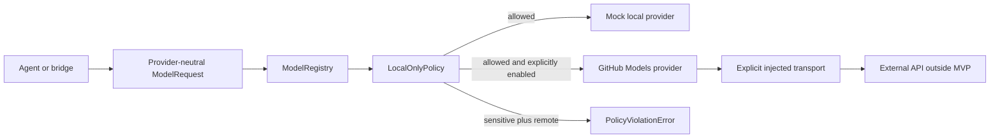

# KVP Model Gateway MVP

Status: implemented MVP

## Purpose

The KVP Model Gateway is the minimal executable slice of the model and tool
fabric described in [Model/tool fabric](model-tool-fabric.md). It normalizes model
discovery and completion requests, enforces data-boundary policy before dispatch,
and keeps provider credentials outside requests, registries, prompts, and source
control.

The gateway lives under `kernel/model_gateway` because it is a policy and routing
component shared by agents and bridges. It does not duplicate the agent prompt
catalog, the bridge transport, the Rust KVP control plane, or the administrative
adapter contract.

## Existing component boundaries

| Existing component | Relationship to the gateway |
| --- | --- |
| `agent/config.json` | Declares agent-facing model names. A later integration may map those names to registered model IDs. |
| `agent/soul_prompt.md` | Supplies prompt content. It is not a provider or a credential source. |
| `bridges/` | Supplies user/channel transport. Bridges call the gateway instead of embedding provider credentials or provider-specific HTTP. |
| `docs/model-tool-fabric.md` | Defines the architectural baseline for `ModelEndpoint`, routing, trust boundaries, and credentials. |
| `docs/adapter-contract.md` | Covers administrative engine adapters. The Model Gateway provider interface covers inference and does not replace that contract. |
| `crates/kvp-core` | Remains the protocol security-domain library. The Python MVP does not claim KVP transport, mTLS, or durable audit guarantees. |

## MVP components

The MVP implements:

- immutable `Message`, `ModelRequest`, `ModelResponse`, and `ModelEndpoint` data
  contracts;
- a minimal `ModelProvider` interface;
- exact model-to-provider registration without implicit fallback;
- duplicate provider and model rejection;
- a deny-before-dispatch local-only policy for sensitive data;
- a deterministic local mock provider;
- a GitHub Models provider boundary that is disabled by default;
- JSON bootstrap configuration and standard-library contract tests.

## Provider contract

Every provider declares:

- a stable provider name;
- a `local` or `remote` trust boundary;
- whether the provider is enabled;
- the exact model IDs it serves;
- capabilities for each endpoint;
- a provider-neutral completion operation.

Providers must reject unknown model IDs. The registry validates that endpoint
provider names and trust boundaries match the provider declaration. A model ID
can belong to only one provider in a registry.

## Request classification and local-only policy

`ModelRequest.data_classification` supports `public`, `internal`, and `sensitive`.
The default is `sensitive`, so an omitted classification cannot silently permit
remote egress. Runtime construction also requires a `DataClassification` enum;
string lookalikes such as `"sensitive"` are rejected instead of bypassing policy.

The MVP rule is:

| Classification | Local provider | Remote provider |
| --- | --- | --- |
| `public` | Allowed | Allowed when explicitly configured and enabled |
| `internal` | Allowed | Allowed when explicitly configured and enabled |
| `sensitive` | Allowed | Denied before provider or credential access |

The registry performs policy enforcement before checking provider availability
or invoking provider code. There is no automatic fallback from a local model to
a remote model.

## Default registry

`kernel/model_gateway/config.json` is the non-secret bootstrap configuration.
Its default state is:

- `mock` is enabled with `mock/local-echo`;
- `github_models` is disabled;
- the GitHub Models model list is empty;
- the sensitive data policy is `local_only`;
- the only accepted GitHub credential source is `GITHUB_MODELS_TOKEN`.

No provider token belongs in the JSON configuration. The environment variable is
documented with an empty value in `.env.example`.

## GitHub Models adapter boundary

`GitHubModelsProvider` is intentionally disabled by default. Enabling it requires
all of the following:

1. an explicit configuration change;
2. an explicit non-empty model ID list;
3. `GITHUB_MODELS_TOKEN` in the process environment;
4. an explicitly injected `GitHubModelsTransport` implementation;
5. a request classification that permits remote processing.

The MVP does not include a concrete HTTP transport, endpoint URL, API-version
assumption, model download, model discovery call, or background network action.
This keeps the provider interface testable without claiming compatibility with
an external API contract that was not verified during this implementation.

The provider constructor does not accept a token. The credential is resolved at
call time only from `GITHUB_MODELS_TOKEN`, is passed only to the injected
transport, and is never included in responses or registry descriptors.

## Failure behavior

The gateway fails closed for:

- unknown models and providers;
- duplicate model or provider registration;
- sensitive data routed to a remote provider;
- disabled providers;
- missing mandatory environment credentials;
- empty or whitespace-only environment credentials;
- enabled GitHub Models provider without an explicit transport;
- non-boolean provider enablement values;
- a local-only policy that does not include sensitive data;
- invalid configuration version or credential source.

Provider error payload normalization, structured audit, retries, quotas,
streaming, tool calls, budgets, residency rules, and durable routing evidence are
outside this MVP.

## Contract tests

`tests/test_model_gateway_contract.py` runs entirely locally with `unittest`.
The same contract assertions cover the mock and GitHub Models providers. A fake
in-memory GitHub transport proves provider normalization without network access.

The tests verify:

- endpoint metadata and completion response normalization;
- unknown-model rejection;
- GitHub Models disabled-by-default behavior;
- environment-only credential loading;
- runtime classification and provider-enablement validation;
- explicit transport requirement;
- local-only enforcement before remote dispatch;
- no implicit fallback;
- duplicate registration rejection;
- default configuration state.

## Next integration step

The next milestone should add an agent-facing gateway service boundary and a
separately reviewed GitHub Models HTTP transport. That transport requires a
verified external API contract, bounded timeouts, response size limits, error
redaction, audit metadata without prompts or credentials, and tests using a local
HTTP fixture. It must remain disabled until those acceptance criteria are met.
