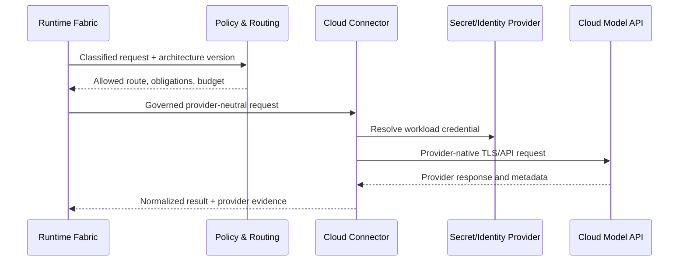

# Model, tool, and connector fabric

Status: architecture baseline

## Unified endpoint model

NetCityOS represents local engines and cloud models as `ModelEndpoint` objects
with explicit trust and capability descriptors. A descriptor includes provider,
model/version reference, modality, context limits, tool support, streaming,
regions, data handling class, cost/quotas, evidence level, and administrative
operations.

Uniform discovery does not imply uniform guarantees. The scheduler may compare
only capabilities that are backed by the connector and policy catalog.

## Connector types

| Connector | Trust boundary | Typical capabilities |
| --- | --- | --- |
| Local engine adapter | Customer-controlled process/host | deep lifecycle/status controls where engine supports them |
| Private cloud endpoint | Customer/provider shared boundary | managed inference plus selected network/identity controls |
| Public cloud model API | Provider-controlled service | documented request, tool, quota, region, and safety controls |
| Enterprise AI gateway | Organization-controlled egress boundary | provider mediation, DLP, budgets, routing, and audit references |
| Tool connector | Internal or SaaS business system | typed actions with least-privilege credentials and approval classes |

## Cloud provider flow

KVP protects the NetCityOS control relationship to the connector. Provider-native
TLS and identity protect the external hop. The connector cannot claim that KVP
cryptographically protects operations inside the provider.

## Tool invocation

Tools use typed schemas, immutable connector versions, scoped identities,
timeouts, idempotency declarations, side-effect classes, and output data
classification. High-risk tools require approval or step-up authentication.
Model text is always untrusted input; the runtime validates a proposed call
against schema and policy before a connector receives it.

## Routing policy

Routes can optimize for capability, data residency, trust/evidence level,
latency, availability, contractual restriction, budget, or evaluation score.
Cost cannot override a mandatory security or residency constraint. Every route
decision records policy/catalog versions and the chosen endpoint.

## Credential boundary

- Bring-your-own-provider credentials are referenced, never embedded in graphs.
- Connector workloads receive only provider- and scope-specific credentials.
- Browser clients and model prompts never receive raw provider secrets.
- Rotation and revocation are independent for each connector and cell.
- Provider error payloads are redacted before audit or user display.
