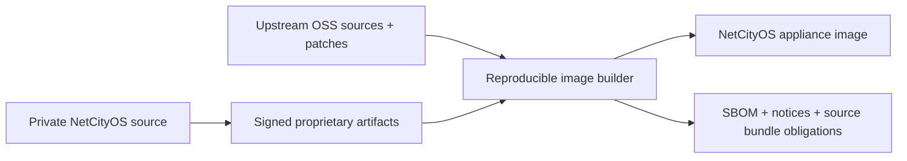

# Open-source and proprietary-code boundary

Status: mandatory release policy draft

## Principle

Using an open-source base can remove per-node operating-system royalties, but it
does not remove license obligations. NetCityOS remains closed source only when
each dependency, modification, link boundary, distribution obligation, and
trademark condition is understood and satisfied.

Official references current on 2026-07-20:

- [Debian license information](https://www.debian.org/legal/licenses/)
- [Debian installation guide: copyrights and software licenses](https://www.debian.org/releases/stable/arm64/ch01s08.en.html)
- [Yocto licensing and generated license manifests](https://docs.yoctoproject.org/dev/overview-manual/development-environment.html#licensing)

## Repository and package separation

The private repository never imports third-party code without recorded origin,
version, license, and approval. Putting code in a container does not by itself
resolve derivative-work or license compatibility questions.

## Preliminary dependency policy

| Review class | Typical licenses/components | Default action |
| --- | --- | --- |
| Preferred | MIT, BSD, ISC, Zlib, Apache-2.0 | Allow after notice, patent, and provenance checks |
| Conditional | LGPL, MPL, EPL, CDDL, GPL executables/kernel | Legal/architecture review and fulfillment plan |
| Restricted | AGPL/network copyleft, SSPL/source-available, non-commercial, no-derivatives | Do not use without executive and specialist approval |
| Prohibited | No license, unknown origin, incompatible redistribution, copied vendor code | Reject |

This table is an internal intake policy, not a legal interpretation of any
particular component. Each exact version and usage mode requires review.

## Release gates

Every release produces and archives:

1. machine-readable SBOM for base image and every product artifact;
2. dependency and license inventory with source URLs and checksums;
3. attribution and license-notice bundle;
4. corresponding-source or written-offer package where required;
5. patch inventory for copyleft components;
6. proprietary/OSS boundary review and static/dynamic link report;
7. vulnerability status, exceptions, and remediation owner;
8. trademark/branding review for redistributed distributions and drivers.

## Build controls

- dependencies are locked by digest and obtained through an internal mirror;
- builds fail on missing/unknown licenses or unapproved package sources;
- proprietary secrets never enter upstream source bundles;
- modified copyleft sources and build scripts are reproducibly recoverable;
- binary blobs/firmware/drivers have an explicit redistribution record;
- notices and source compliance artifacts are tested as part of the installer.

## Customer materials

The appliance includes a product EULA for proprietary NetCityOS components and a
separate third-party notices/source-access section. The EULA cannot override
rights granted by third-party open-source licenses. Customer support must know
how to fulfill a source request without exposing proprietary repositories.

## Ownership and contribution hygiene

Internal contributors sign employment/assignment and confidentiality documents.
External contributions are not accepted into the closed core without a written
rights transfer or company-approved contribution agreement. Generated or
AI-assisted code is reviewed by a responsible human, provenance is recorded, and
unverifiable copied fragments are rejected.
