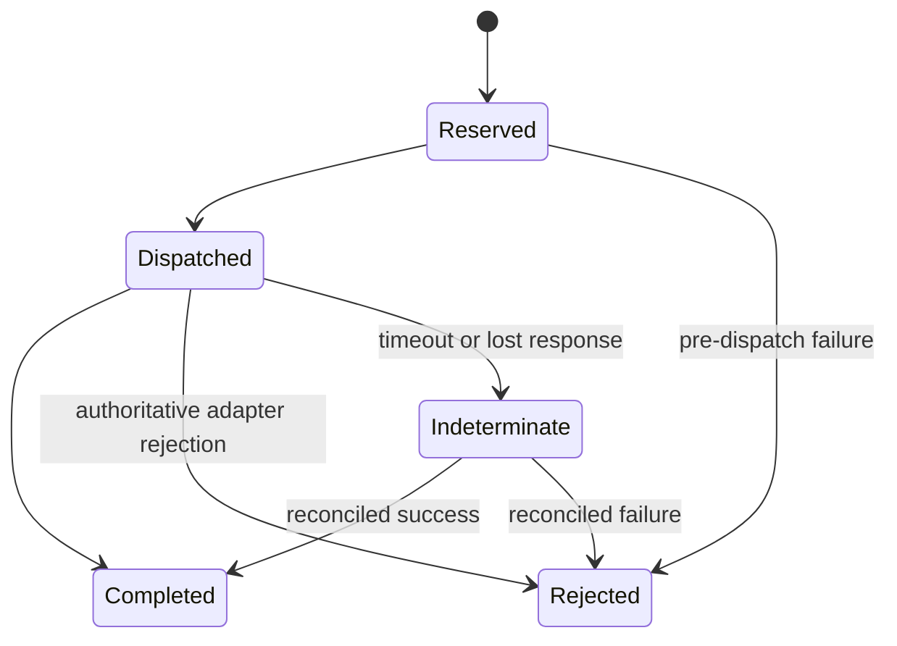

# Persistence model

Status: specified for M2

## Storage choice

KVP uses PostgreSQL as the v0 durable state store. The required properties are
transactions, unique constraints, conditional updates, durable command outcome
storage, and operational familiarity. Redis may be a cache but is not the source
of truth for authorization, revocation, or idempotency.

The M0 in-memory `SessionStore` remains a domain-test implementation. It is not a
production persistence design.

## Logical records

| Record | Key facts | Retention intent |
| --- | --- | --- |
| Principal | canonical ID, type, status, trust domain | While identity exists plus audit policy |
| Certificate binding | fingerprint/identity selector, principal, validity, revocation | Through certificate and audit retention |
| Policy version | immutable policy digest, activation time, author/approval refs | Indefinite or compliance period |
| Session | token verifier, principal, role snapshot, policy version, expiry, last sequence | Short TTL plus investigation window |
| Adapter | workload identity, endpoint reference, environment, health epoch | While registered plus history window |
| Capability snapshot | adapter epoch, descriptor digest, declared capabilities | Through command retention |
| Command | principal, command ID, request hash, target, state, deadlines, outcome | At least maximum client retry/reconciliation window |
| Audit outbox | immutable event envelope and delivery state | Until independently acknowledged |

Private keys and raw session tokens are never database columns. A session record
stores a cryptographic verifier of the 32-byte random token. Database compromise
must not immediately yield reusable bearer tokens.

## Transaction boundaries

### Open session

Validate current principal/certificate status, create the token verifier, capture
the active policy version, and write the session record in one transaction. The
plaintext token exists only long enough to return it over the authenticated TLS
channel.

### Accept command

In one serializable or equivalent guarded transaction:

1. lock or conditionally update the active session;
2. check revocation, expiry, and sequence;
3. insert `(environment, principal_id, command_id)` with canonical request hash;
4. advance the session sequence;
5. insert the pre-dispatch audit outbox event.

A uniqueness conflict loads the existing command and applies idempotency rules.
No adapter call occurs inside the database transaction.

### Record outcome

Conditionally transition the command from a valid prior state and insert its
outcome event into the audit outbox in the same transaction. State transitions
are monotonic except that `COMMAND_STATE_INDETERMINATE` may later resolve to a terminal state
when authoritative evidence arrives.

## Command state machine

Illegal or backward transitions fail and emit an operational alert. Database
constraints and application checks both enforce terminal-state immutability.

## Audit outbox

The transactional outbox prevents a command reservation and its audit evidence
from diverging during a crash. A separate publisher sends events to the external
append-only sink and marks acknowledgements. Events have stable IDs, so sink
delivery is at-least-once and consumers deduplicate by `audit_id`.

## Availability behavior

When PostgreSQL is unavailable, KVP is not ready and rejects new sessions and
commands. It does not fall back to an in-memory authorization or idempotency
store. Read-only cached status may be served only through a separately identified
stale endpoint with its observation timestamp; it is not an authorization path.

## Data protection

- encrypted storage and backups;
- application role with least-privilege schema grants;
- schema migrations signed/reviewed and applied before new replicas become ready;
- tested point-in-time recovery and command/audit consistency checks;
- sensitive identifiers minimized and access-controlled;
- retention jobs preserve records needed to resolve live command IDs.
