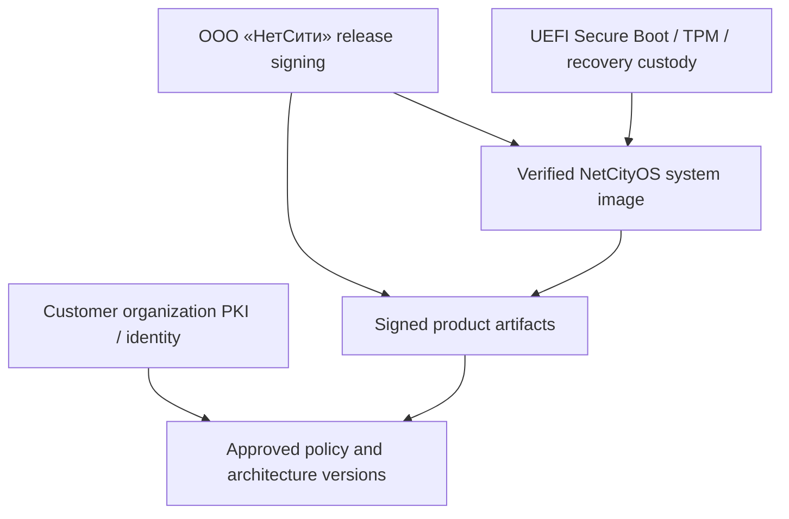

# NetCityOS platform security model

Status: architecture baseline

This model extends the KVP security model to the complete appliance, Enterprise
Workspace, Runtime Fabric, connectors, updates, and recovery environment.

## Protected assets

- organization root identity, product signing trust, recovery material;
- architecture graphs, policies, approvals, provider connection profiles;
- model/tool runtime content and customer data;
- KVP sessions, commands, outcomes, and evidence;
- proprietary NetCityOS binaries, know-how, and conformance materials;
- appliance update authority and persistent state;
- audit continuity and customer-controlled exports.

## Trust anchors

Vendor release signing does not grant the vendor an operator identity inside the
customer organization. Customer identity/policy does not authorize unsigned
system code. Recovery authority is separated from ordinary workspace roles.

## Appliance threats and controls

| Threat | Controls | Remaining concern |
| --- | --- | --- |
| Modified installer/update | offline root, signed manifest/artifacts, measured boot, verification before write | release-key compromise requires revocation/recovery plan |
| Root filesystem tampering | read-only verified image, Secure Boot, TPM measurements | privileged hardware/firmware attacker outside first-release claim |
| Rollback to vulnerable release | signed monotonic release policy, revocation metadata, recovery approval | emergency rollback needs explicit exception evidence |
| Theft of disks/server | encrypted state, TPM-bound unlock plus recovery controls | live unlocked machine and memory attacks |
| Malicious local administrator | separation of duties, step-up, immutable audit export, no shell by default | physical/root authority cannot be fully contained by application code |
| Proprietary binary extraction | encryption at rest, signed artifacts, restricted shell/debug, contractual controls | customer-operated hardware cannot guarantee perfect anti-reversing |
| Browser/session compromise | SSO/MFA, secure cookies, CSRF/CSP, short sessions, step-up, no raw secrets | compromised operator endpoint until detection/revocation |
| Cloud data exfiltration | classification, provider/region allowlists, DLP gateway, scoped connectors | provider processing governed by contract and its actual controls |
| Tool-induced side effect | typed schemas, side-effect classes, policy, approvals, idempotency | compromised tool backend may misreport result |
| Extension supply-chain attack | signed registry, capability/permission manifest, sandbox, revocation | approved extension can still contain vulnerabilities |
| Recovery abuse | offline custody, dual control, event recording, post-recovery rekey | loss of all recovery material can make state unavailable |

## Closed-source reality

Closed source protects distribution and raises the cost of copying; it does not
make a binary placed on customer-controlled hardware impossible to inspect. The
security design cannot depend on hidden algorithms. Cryptographic keys remain
separate from binaries, server-side licensing services are optional by customer
deployment policy, and authorization is enforced by validated identity/policy.

Anti-debugging or obfuscation is evaluated only after supportability, incident
response, export controls, accessibility, and customer procurement requirements.
It is not a substitute for secure design or legal protection.

## Administrative surfaces

Production exposes the Enterprise Workspace and documented management APIs. A
local maintenance console is disabled by default, physically/cryptographically
gated, time-bounded, and audited. Direct database, container runtime, and shell
access invalidate normal assurance and trigger a visible degraded-trust state.

## Network zones

- management ingress accepts only enterprise-authenticated operator traffic;
- control traffic uses KVP/mTLS identities;
- runtime/provider egress is destination-allowlisted per connector profile;
- database, audit, and secret networks are separately restricted;
- recovery/update channels are distinct from model/provider traffic;
- air-gapped profiles have no latent call-home requirement.

## Update key hierarchy

An offline root authorizes rotating release-signing keys. Release manifests bind
system image, product artifacts, migrations, SBOM, license notices, hardware
profile, minimum allowed version, and rollback compatibility. Compromise response
includes key revocation, emergency offline bundle, affected-release discovery,
and customer-verifiable recovery evidence.

## Security claim boundary

NetCityOS can claim verified vendor artifacts, controlled appliance state, KVP
delivery/evidence properties, and governed connector behavior to the extent they
are implemented and tested. It does not claim immunity from a compromised
firmware/hypervisor, customer root administrator, enterprise CA, cloud provider,
or model behavior attack.
