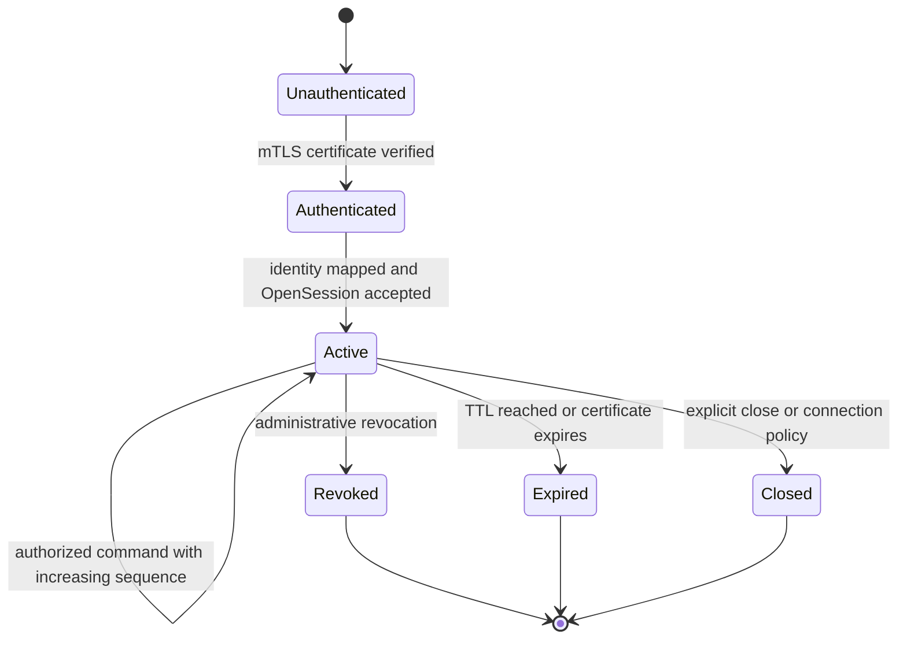

# Protocol lifecycle

Status: partially implemented

## Transport and identity

All production RPCs use TLS 1.3 with mutual certificate authentication. The
transport layer produces a verified principal context containing the canonical
principal identifier, certificate fingerprint, trust domain, and certificate
expiry. `OpenSessionRequest.client_id` is a lookup assertion only: it must match
the principal registry entry selected by the authenticated certificate.

Development transport, when added, is restricted to loopback and must be an
explicit build feature. It is never a runtime flag in a production artifact.

## Session lifecycle

A session token contains at least 256 bits from the operating system entropy
source. The stored session record binds it to the authenticated principal and
certificate identity, role snapshot, issue time, expiry, and latest accepted
sequence. Effective expiry is the earliest of session TTL, certificate expiry,
or principal revocation.

## Command processing order

The following order is normative so implementations do not authorize or dispatch
the same request differently:

1. Enforce transport authentication and coarse request-size/deadline limits.
2. Decode and structurally validate the protobuf message.
3. Resolve the session and compare its principal binding to the current peer.
4. Reject expired, revoked, or deadline-exceeded requests.
5. Look up `(principal_id, command_id)` in the idempotency store.
6. If an identical command already exists, return its recorded state without
   redispatch. If the same ID has a different canonical request hash, reject it.
7. Verify that `sequence` is greater than the latest accepted session sequence.
8. Evaluate current policy and adapter capability; authorization is deny-by-default.
9. Atomically reserve the command ID and advance the accepted sequence.
10. Write the authorization/audit decision required before dispatch.
11. Dispatch to the selected adapter with the remaining deadline.
12. Persist the terminal result and emit the outcome audit event.

The currently implemented core covers session creation, expiry, revocation,
role authorization, and strictly increasing sequences. Certificate binding and
steps 5–12 remain implementation work.

## Retry and idempotency semantics

- `command_id` is a client-generated UUID or equivalent 128-bit unique value.
- A retry repeats the same command ID, sequence, operation, payload, and deadline.
- The canonical request hash excludes transport metadata but includes all fields
  that can alter adapter behavior.
- A duplicate of an accepted command returns the existing result or current state.
- A reused command ID with a different hash returns `ERROR_CODE_COMMAND_ID_CONFLICT`.
- A new command with an old sequence returns `ERROR_CODE_SEQUENCE_REJECTED`.

Sequence numbers provide ordering inside one session. Command identities provide
safe retry behavior across reconnects and, for their retention period, across
new sessions belonging to the same principal.

## Deadlines and outcomes

The client deadline is an absolute Unix timestamp in the current protobuf. The
server also honors the gRPC deadline and applies the earlier value. Clock skew is
bounded operationally and monitored. The response model distinguishes:

- `COMMAND_STATE_REJECTED`: not dispatched;
- `COMMAND_STATE_ACCEPTED`: durably reserved and possibly in progress;
- `COMMAND_STATE_COMPLETED`: terminal result recorded;
- `COMMAND_STATE_INDETERMINATE`: dispatch may have happened but a terminal outcome is unknown.

An indeterminate response is reconciled through `GetCommand`. A terminal result
may replace an indeterminate state only when KVP later obtains authoritative
adapter or engine evidence; the transition is preserved in the audit history.

## Error taxonomy

| Stable code | Meaning | Retry guidance |
| --- | --- | --- |
| `ERROR_CODE_UNAUTHENTICATED` | Certificate or session is invalid | Re-authenticate; do not blind retry |
| `ERROR_CODE_PERMISSION_DENIED` | Principal lacks permission | Do not retry without policy change |
| `ERROR_CODE_SESSION_EXPIRED` | Session TTL or certificate lifetime ended | Open a new session |
| `ERROR_CODE_SEQUENCE_REJECTED` | Sequence was repeated or reordered | Reconcile client state |
| `ERROR_CODE_COMMAND_ID_CONFLICT` | Same ID used for a different command | Generate a new ID after correcting client logic |
| `ERROR_CODE_UNSUPPORTED_OPERATION` | Adapter lacks declared capability | Select another adapter or operation |
| `ERROR_CODE_INVALID_COMMAND` | Typed payload or scope violates the contract | Correct the request; do not blind retry |
| `ERROR_CODE_DEADLINE_EXCEEDED` | Rejected before dispatch | Retry with a new command ID only when safe |
| `ERROR_CODE_OUTCOME_INDETERMINATE` | Dispatch outcome is unknown | Call `GetCommand`; never blind redispatch |
| `ERROR_CODE_DEPENDENCY_UNAVAILABLE` | Required state, policy, adapter, or audit dependency failed | Retry with bounded backoff |
| `ERROR_CODE_INTERNAL_ERROR` | Unexpected server failure before a known outcome | Reconcile command state before retry |

Human-readable error text is diagnostic only. Automation branches on stable
codes and gRPC status, never localized strings.
